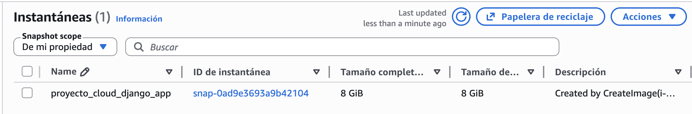
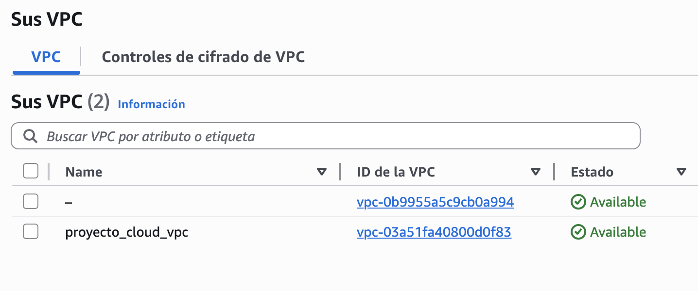
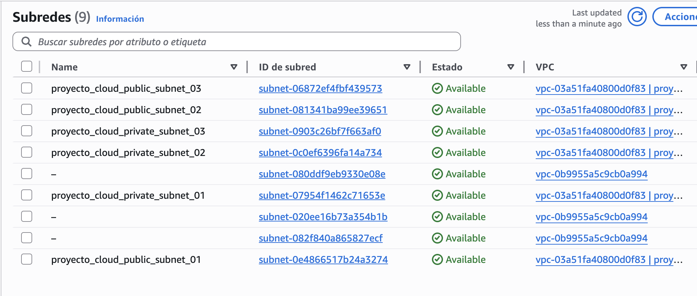

# Cloud Project
This project deploys the REST MIMO Movies API in the cloud using a scalable architecture, automated through:
- Docker
- Infrastructure as Code
- AMIs creation

It transforms a local API into a fully automated, scalable, cloud-native deployment on AWS.

The infrastructure includes:
- Custom VPC
- Public and private subnets
- Internet Gateway
- Application Load Balancer (ALB)
- Auto Scaling Group (ASG)
- EC2
- RDS MySQL
- S3
- Security Groups configured per module
- Custom AMI created with Packer

## General architecture
```
Internet
   │
   ▼
ALB (port 80)
   │
   ▼
EC2 (Docker container - MIMO Movies)
   │
   ▼
RDS MySQL (private subnets)
```
```
proyectoCloud/
│
├── MIMO Movies/
│
├── docker/
│   └── Dockerfile
│
├── aws/
│   ├── packer/
│   └── terraform/
│
└── README.md
```

## MIMO Movies API(Express + TypeScript)
This project is an extension of my other project Api with testing in [**Github**](https://github.com/AdrianMalmierca/Api-with-testing)

## Docker

### Why?
1. Encapsulates the application
2. Guarantees consistency across environments
3. Simplifies deployment inside EC2

Dockerfile:
- Starts on Ubuntu 24.04
- Install:
   - AWS CLI
   - Terraform
   - Packer
   - Python
   - Git
- Configure a complete DevOps environment
- Runs bash by default
- This container is a portable DevOps machine, not just for the API.

## Packer
Packer creates a custom AMI in AWS that:
   - Installs Docker
   - Copies the MIMO Movies project
   - Builds the Docker image
   - Leaves the instance ready to run the app

Result: An AMI ready to production

### Problem it solves:
1. Avoids slow bootstrapping
2. Avoids runtime installation scripts
3. Ensures immutable infrastructure

## Terraform:
- Terraform defines the entire infrastructure on AWS.

```
Modular structure:
   terraform/
   ├── modules/
   │   ├── vpc/
   │   ├── subnet/
   │   ├── internet_gateway/
   │   ├── route/
   │   ├── alb/
   │   ├── asg/
   │   ├── ec2_instance/
   │   ├── rds/
   │   ├── s3/
   │   └── security_group_rule/
   │
   ├── network.tf
   ├── ec2.tf
   ├── alb.tf
   ├── asg.tf
   ├── rds.tf
   ├── s3.tf
   ├── provider.tf
   ├── variables.tf
   └── outputs.tf
```

### Problem it solves:
1. Manual AWS configuration
2. Error-prone console setup
3. Non-versioned infrastructure
4. Lack of reproducibility


### Terraform modules
Each module encapsulates a specific AWS resource.

#### vpc/
Isolates infrastructure in a private network.

Creates:
- Custom VPC
- Enabled DNS hostnames
- Output:
- vpc_id
- Default route table
- Default security group

#### subnet/
- Dynamically creates multiple subnets using for_each.
- Used for:
   - Public subnets (EC2, ALB)
   - Private subnets (RDS)

- Solves:
   - Security best practices
   - Database isolation

#### internet_gateway/
- Enables the VPC to have internet access.

#### route/
- Creates routes in a route table.

Example:
- 0.0.0.0/0 → Internet Gateway

#### alb/
Creates:
- Application Load Balancer
- Target Group
- HTTP Listener (port 80)
- Health check in /movies
- Distributes traffic to EC2.

#### asg/
Creates:
- Launch Template
- Auto Scaling Group
- Connects to the ALB Target Group
- Allows automatic scaling between 1 and 2 instances.

#### ec2_instance/
- Creates EC2 instances directly (without ASG).
- Includes:
   - user_data
   - SSH key
   - Network configuration

#### rds/
Managed database service

Creates:
- DB Subnet Group
- RDS MySQL 8.0
- Private Security Group
- Databases in private subnets.

#### s3/
Object storage

Creates:
- Bucket
- ​​Optional versioning
- AES256 encryption

#### security_group_rule/
- Allows creating security group rules as a reusable module.
- Excellent modular practice.
- Act as virtual firewalls.

## Installation
1. Clone the repository
```bash
git clone https://github.com/AdrianMalmierca/Cloudproject
```

From MIMO Movies/:
2. Builds a Docker image named mimo-movies from the current directory (.).
``` bash 
docker build -t mimo-movies .
```

3. Runs the mimo-movies container, exposing port 3000 to access the app locally.
``` bash
docker run -p 3000:3000 mimo-movies
```

Try in the browser: http://example-alb-1756634364.eu-west-1.elb.amazonaws.com/movies

From root (Cloudproject):

4. Build the image for packer and terraform
```bash
docker build -t terraform-packer-awscli -f docker/Dockerfile .
```

5. Starts a container with AWS credentials and the current workspace mounted, for executing Packer or Terraform commands interactively.
```bash
docker run -it --rm \
  -v ~/.aws:/root/.aws \
  -v $(pwd):/workspace \
  -w /workspace/aws/packer \
  terraform-packer-awscli \
  bash
```
6. You need to put your credentials of aws: Your user id, your password, the region and the format. You need to be able to create everything on your account.
```bash
aws configure
```

## Packer execution
7. Before running the Packer commands, ensure you have initialized the Packer configuration. This step downloads the necessary plugins.

```bash
packer init .
```

### Packer formatting
8. Format your template. Packer will print out the names of the files it modified, if any. In this case, your template file was already formatted correctly, so Packer won't return any file names.

```bash
packer fmt .
```

### Packer validation
9. Validate your template. If Packer detects any invalid configuration, Packer will print out the file name, the error type and line number of the invalid configuration. The example configuration provided above is valid, so Packer will return nothing.

```bash
packer validate .
```

### Building the AMI
10. Build the image with the packer build command. Packer will print output similar to what is shown below.
```bash
packer build .
```

When packer is finished you will see:


You need the ami created for the next step on terraform, so you should keep it.

In AWS you can see the snapshot asociated to the AMI created by packer, going on EC2 -> snapshot.


## Terraform execution
11. Now go to terraforms directory.
```bash
cd /workspace/aws/terraform
```

### Terraform initialization
12. Before running the Terraform commands, ensure you have initialized the Terraform configuration. This step downloads the necessary provider plugins.
```bash
terraform init
```

### TF_VAR_ami_id
13. Assigns the ID of the custom AMI (created by Packer) to the Terraform variable ami_id.
Terraform uses this AMI when launching EC2 instances or Auto Scaling Groups (ASG).

```bash
export TF_VAR_ami_id=ami-x
```

### TF_VAR_rds_password
14. Assigns the admin password for the RDS MySQL database to the Terraform variable rds_password.
This avoids hardcoding sensitive credentials in your code.

```bash
export TF_VAR_rds_password="PasswordSegura123!"
```

### Terraform Plan
15. To see what changes Terraform will make to your AWS environment, run the following command. This generates an execution plan without making any changes.

> You can use the `-out` option to save the plan to a file for later execution:

```bash
terraform plan -out=tfplan
```

### Terraform Apply
14. To apply the changes defined in your Terraform configuration, run the following command. This will create the networking resources in your AWS account.

> After running this command, Terraform will prompt you to confirm the changes. Type `yes` to proceed.

```bash
terraform apply tfplan
```

### Terraform output
Prints the values of output variables defined in your Terraform modules.
For example, it can show:
- ec2_instance_public_ip → Public IP of your EC2 instance
- rds_endpoint → Endpoint to connect to the RDS database
- s3_bucket_name → Name of your S3 bucket
- alb_dns_name → DNS name of your Application Load Balancer

```bash
terraform output
```

When terraform is finished you'll something like:


If you want to access to the API, you need the alb_dns_name, so you replace the localhost:3000 for "example-alb-1756634364.eu-west-1.elb.amazonaws.com". For example:

Before: http://localhost:3000/movies

Now: http://example-alb-1756634364.eu-west-1.elb.amazonaws.com/movies

On AWS you can see the nets in the VPC dahsborad:


And subnets:


## SSH conection to EC2 Instance
To connect to the EC2 instance created by Terraform, you need to use SSH. A key pair is generated during the Terraform apply process, and you can use it to connect to the instance.

```bash
ssh -i ec2_key.pem ubuntu@<EC2_INSTANCE_PUBLIC_IP>
```

## Terraform Destroy
To clean up and remove all the resources created by Terraform, you can run the destroy command. This will delete all the resources defined in your Terraform configuration.

```bash
cd aws/terraform
```

```bash
terraform destroy
```

## Execution:
### GET all movies
You obtain the movie list.
```bash
curl http://example-alb-1756634364.eu-west-1.elb.amazonaws.com/movies
```


### GET movie by id
You obtain the movie id you put on the url, in case it exist.
```bash
curl http://example-alb-1756634364.eu-west-1.elb.amazonaws.com/movies/1
```


### GET ratings by movie id
You obtain all the ratings of the movie id you put on the url, in case it exist.
```bash
curl http://example-alb-1756634364.eu-west-1.elb.amazonaws.com/movies/1/ratings
```


### GET rating by id by movie id
You obtain the rating of the movie id and the rating id you put on the url, in case it exist.
```bash
curl http://example-alb-1756634364.eu-west-1.elb.amazonaws.com/movies/1/ratings/4
```


### ADD rating by movie id
You add the rating putting all the attributes in the body. You need authorization.
```bash
curl http://example-alb-1756634364.eu-west-1.elb.amazonaws.com/movies/5/ratings
```


You need to put the rating and the comment in the body:


### UPDATE rating by movie id and rating id
You update the rating putting the id in the url and changing the comment and/or the rating. You need authorization.
```bash
curl http://example-alb-1756634364.eu-west-1.elb.amazonaws.com/movies/5/ratings
```


You don't need to put the rating or the comment to update:


### DELETE rating by movie id and rating id
You delete the rating putting the id in the url. You need authorization.
```bash
curl http:/example-alb-1756634364.eu-west-1.elb.amazonaws.com/movies/5/ratings/11
```


### GET watchlist by user id
You get all the watchlist of the user you put the id in th url. You need authorization.
```bash
curl http://example-alb-1756634364.eu-west-1.elb.amazonaws.com/watchlist/1
```


### ADD watchlist by user id
You create a watchlist for the user put the id in the url. You need authorization.
```bash
curl http://example-alb-1756634364.eu-west-1.elb.amazonaws.com/watchlist/1/items
```


You need to put the id of the movie of which you can add the watchlist:


### UPDATE watchlist by user id and watchlist id
You update the watchlist of the user you put the id in the url with the id of the watchlist. You only update the attribute "watched". You need authorization.
```bash
curl http://example-alb-1756634364.eu-west-1.elb.amazonaws.com/watchlist/1/items/10
```


You need to put the attribute wacthed, changing the value:


### DELETE watchlist by user id and watchlist id
You delete a watchlist of the user put the id in the url. You need authorization.
```bash
curl http://example-alb-1756634364.eu-west-1.elb.amazonaws.com/watchlist/1/items/10
```


### Bad authorization
For example, if you don't put the api key as a header or is wrong, you won't be able to do the method.


## Key backend concepts demonstrated
- RESTful API design
- Layered architecture
- Authentication middleware
- Database aggregation queries
- Pagination patterns
- Validation with Joi
- Error handling best practices
- Business rule enforcement
- Separation of concerns

## Key cloud and infrastructure concepts demonstrated
- Infrastructure as Code (IaC) using Terraform
- Immutable infrastructure with Packer
- Custom AMI creation on Amazon Web Services
- Containerized deployment with Docker
- Virtual Private Cloud (VPC) network design
- Public and private subnet segmentation
- Internet Gateway and route table configuration
- Security Groups with granular ingress/egress rules
- Application Load Balancer (ALB) architecture
- Target Groups and health checks configuration
- Auto Scaling Group (ASG) with Launch Templates
- Bootstrapping instances via user_data
- Managed relational database provisioning with Amazon RDS (MySQL 8)
- Private database access restricted by security groups
- S3 bucket provisioning with versioning and server-side encryption
- Key pair generation and SSH access management
- Modular Terraform architecture (reusable modules)
- Sensitive variable handling via environment variables (TF_VAR_*)
- Multi-AZ subnet distribution for high availability
- Separation of application layer and infrastructure layer
- Declarative resource provisioning and state management

## What did I learn?
This project has helped me learn how to create an API from scratch. I've also learned how to do it using Packer and Terraform. Although the cloud part is quite complex and not something a junior programmer can easily do, little by little I've come to understand what each part does, and how each part individually forms the whole.

## Author
Adrián Martín Malmierca 

Computer Engineer & Mobile Applications Master's Student